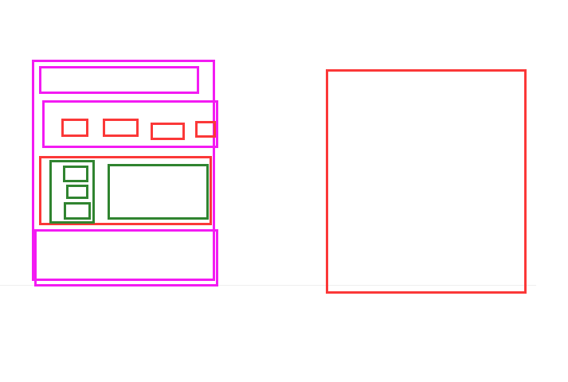
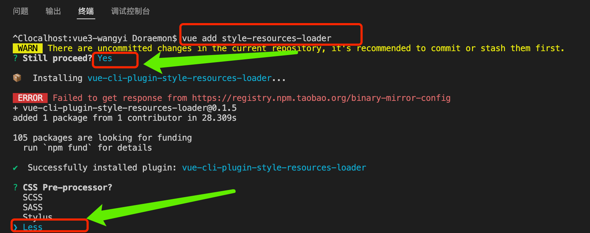
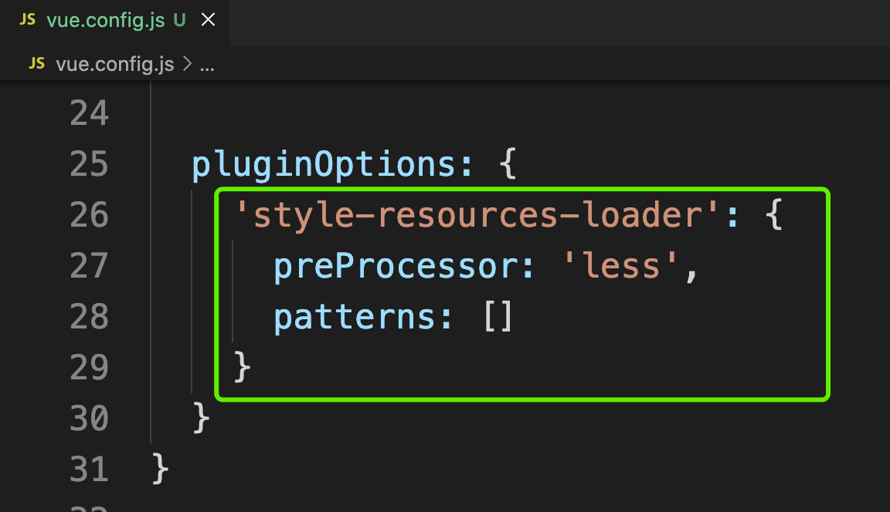
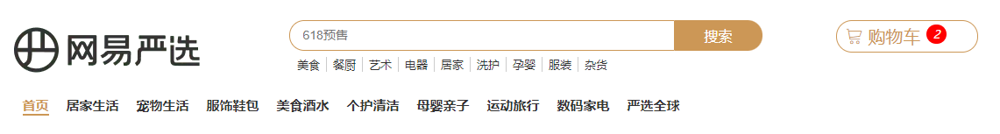
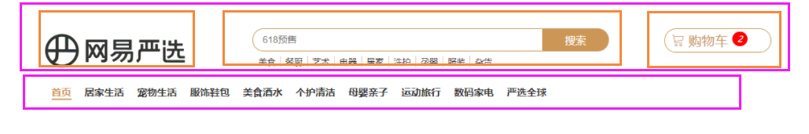

# Vue3项目 网易严选_第一天

**主要内容**

* 项目搭建
* vuex基础
* 路由设计
* 首页顶部和底部布局

**学习目标**

 知识点| 要求 
 -| :- 
 项目搭建 | 掌握 
 vuex基础 | 掌握 
 路由设计 | 掌握 
 首页顶部和底部布局 | 掌握 


## 一、项目搭建

### 1.1 创建项目

1. vue create vue-wangyi
2. 选择vue3.0版本


### 1.2 目录调整

大致步骤：

- 删除无用代码和文件
- 完善项目的基础结构
- 读懂默认生成的代码

落的代码：	

注意：以上结构目录及供参考


## 三、路由设计

### 3.1 路由布局



​	

### 3.2 路由基础实现

路由文件index.js

```js
import { createRouter, createWebHashHistory } from 'vue-router'

//异步加载组件
const Layout = ()=>import('@/views/Layout.vue')
const Home = ()=>import('@/views/home')
import TopCategory from '@/views/category'
import SubCategory from '@/views/category/sub'

const routes = [
    {
      path:'/',
      component:Layout,
      children:[
        { path:'/',component:Home},
        { path: '/category/:id', component: TopCategory },
        { path: '/category/sub/:id', component: SubCategory }
      ]
    }
]

const router = createRouter({
  history: createWebHashHistory(),
  routes
})

export default router

```

App.vue

```vue
<template>
  <!-- 一级路由 -->
  <router-view />
</template>
<script>
export default {
  setup() {},
};
</script>

<style lang="less">
</style>

```

一级路由布局容器 `src/views/Layout.vue`

```vue
<template>
  <nav>顶部通栏</nav>
  <header>头部</header>
  <main>
    <!-- 二级路由 -->
    <router-view></router-view>
  </main>
  <footer>底部</footer>
</template>

<script>
export default {
  name: 'xtx-layout'
}
</script>

<style scoped lang='less'></style>
```

二级路由首页组件 `src/views/home/index.vue`

```vue
<template>
  <div class='xtx-home-page'>
    首页
  </div>
</template>

<script>
export default {
  name: 'xtx-home-page'
}
</script>

<style scoped lang='less'></style>
```

### 3.3 样式配置

#### （1）重置样式

#### （2）less变量变量

 `src/assets/styles/variables.less`

```less
// 主题
@xtxColor:#27BA9B;
// 辅助
@helpColor:#E26237;
// 成功
@sucColor:#1DC779;
// 警告
@warnColor:#FFB302;
// 价格
@priceColor:#CF4444;
```

#### （3）混入

 `src/assets/styles/mixins.less`

```less
// 鼠标经过上移阴影动画
.hoverShadow () {
  transition: all .5s;
  &:hover {
    transform: translate3d(0,-3px,0);
    box-shadow: 0 3px 8px rgba(0,0,0,0.2);
  }
}
```

less混入就是，申明一段css代码（选择器包裹的代码）或者函数，在其他css选择器调用，可复用包裹的代码

#### （4）**完成自动注入公用变量和混入**

==**遇到问题：** 每次使用公用的变量和mixin的时候需要单独引入到文件中。==


**解决方法：** 使用vuecli的style-resoures-loader插件来完成自动注入到每个less文件或者vue组件中style标签中。

- 在当前项目下执行一下命令`vue add style-resources-loader`，添加一个vuecli的插件

  


- 安装完毕后会在`vue.config.js`中自动添加配置，如下：

  

```js
//上面一定要引入
const path = require('path');

module.exports = {
  pluginOptions: {
    'style-resources-loader': {
      preProcessor: 'less',
      patterns: []
    }
  }
}
```

- 把你需要注入的文件配置一下后，重启服务即可。

```diff
+const path = require('path')
module.exports = {
  pluginOptions: {
    'style-resources-loader': {
      preProcessor: 'less',
      patterns: [
+        path.join(__dirname, './src/assets/styles/variables.less'),
+        path.join(__dirname, './src/assets/styles/mixins.less')
      ]
    }
  }
}
```

**总结：** 知道如何定义less变量和混入代码并使用他们，通过vue-resources-loader完成代码注入再每个less文件和vue组件中。


#### （5） 引入字体图标

1）在 `public/index.html` 引入字体图标文件。


## 四、首页顶部和底部布局

### 4.1 顶部通栏布局

​	

代码演示：

```vue
<template>
  <nav class="app-topnav">
    <div class="container">
      <ul>
        <template v-if="profile.token">
          <li>
            <a href="javascript:;"><i class="iconfont icon-user"></i>周杰伦</a>
          </li>
          <li><a href="javascript:;">退出登录</a></li>
        </template>
        <template v-else>
          <li><a href="javascript:;">请先登录</a></li>
          <li><a href="javascript:;">免费注册</a></li>
        </template>

        <li><a href="javascript:;">我的订单</a></li>
        <li><a href="javascript:;">会员中心</a></li>
        <li><a href="javascript:;">帮助中心</a></li>
        <li><a href="javascript:;">关于我们</a></li>
        <li>
          <a href="javascript:;"><i class="iconfont icon-phone"></i>手机版</a>
        </li>
      </ul>
    </div>
  </nav>
</template>
<script>
import { computed } from "@vue/runtime-core";
import { useStore } from "vuex";

export default {
  name: "AppTopnav",
  setup() {
    const store = useStore();
    const profile = computed(() => {
      return store.state.user.profile;
    });

    return { profile };
  },
};
</script>
<style scoped lang="less">
.app-topnav {
  background: #333;
  ul {
    display: flex;
    height: 40px;
    justify-content: flex-end;
    align-items: center;
    li {
      a {
        padding: 0 15px;
        color: #cdcdcd;
        line-height: 1;
        display: inline-block;
        i {
          font-size: 14px;
          margin-right: 2px;
        }
        &:hover {
          color: @xtxColor;
        }
      }
      ~ li {
        a {
          border-left: 2px solid #666;
        }
      }
    }
  }
}
</style>
```

布局界面

```vue
<template>
  <div>
    <!-- 顶部区域 -->
    <AppTopnav/>
  </div>
</template>
<script>
import AppTopnav from '@/components/app-topnav.vue';

export default {
  name:'Layout',
  components:{
    AppTopnav,
  },
};
</script>
<style lang="less" scoped>
.main{
  min-height: 500px;
}
.active{
  color: @xtxColor;
  .hoverShadow()
}
</style>
```

### 4.2 头部布局



​	

代码演示：

```vue
<template>
  <header class="app-header">
    <div class="container">
      <!-- 顶部区域 -->
      <div class="app-top">
        <h1 class="logo">
          <RouterLink to="/">
            
          </RouterLink>
        </h1>
        <div class="center">
          <div class="center-search">
            <input type="text" />
            <div class="btn">搜索</div>
          </div>
          <ul class="navs">
            <li><a href="#">美食</a></li>
            <li><a href="#">餐厨</a></li>
            <li><a href="#">艺术</a></li>
            <li><a href="#">电器</a></li>
            <li><a href="#">居家</a></li>
            <li><a href="#">洗护</a></li>
            <li><a href="#">孕婴</a></li>
            <li><a href="#">服装</a></li>
            <li><a href="#">杂货</a></li>
          </ul>
        </div>

        <div class="search">
          <i class="iconfont icon-search"></i>
          <input type="text" placeholder="搜一搜" />
        </div>
        <div class="cart">
          <a class="curr" href="#">
            <i class="iconfont icon-cart"></i><em>2</em>
          </a>
        </div>
      </div>
      <!-- 二级导航 -->
      <div class="app-nav">
          <AppHeaderNav/>
      </div>
    </div>
  </header>
</template>

<script>
import AppHeaderNav from './app-header-nav.vue';

export default {
  name: "AppHeader",
  components:{
    AppHeaderNav
  }
};
</script>

<style scoped lang='less'>
.app-header {
  background: #fff;
  .app-top {
    display: flex;
    align-items: center;
  }
  .logo {
    width: 200px;
    a {
      display: block;
      height: 100px;
      width: 100%;
      margin-top: 15px;
    }
  }
  .center {
    position: relative;
    margin-top: 26px;
    flex: 1;
    .center-search {
      width: 532px;
      float: right;
      input {
        height: 38px;
        line-height: 38px;
        padding-top: 2px;
        padding-bottom: 2px;
        border: 1px solid #cc9756;
        border-bottom-left-radius: 19px;
        border-top-left-radius: 19px;
        font-size: 14px;
        width: 442px;
        padding-left: 38px;
      }
      .btn {
        width: 90px;
        height: 38px;
        background-color: #cc9756;
        border-top-right-radius: 19px;
        border-bottom-right-radius: 19px;
        cursor: pointer;
        float: right;
        color: #fff;
        line-height: 38px;
        text-align: center;
        font-size: 16px;
        letter-spacing: 1px;
      }
    }
  }
  // 底部导航---------------------
  .app-nav{
     height: 40px;
    .navs{
      float: left;
      li{
        line-height: 40px;
        font-weight: bold;
        a{
          border-right: 0;
           color: #000;
        }
      }
    }
  }
  //-----------------------------
  .navs {
    width: 520px;
    display: flex;
    justify-content: space-around;
    float: right;
    padding-right: 80px;
    li {
      line-height: 32px;
      text-align: center;
      a {
        font-size: 12px;
        line-height: 12px;
        padding: 0 10px;
        display: inline-block;
        border-right: 1px solid #ccc;
        color: #999;
      }
      &:hover {
        a {
          color: @xtxColor;
        }
      }
    }
    li:last-child a {
      border-right: 0;
    }
  }
  .search {
    width: 170px;
    height: 32px;
    position: relative;
    border-bottom: 1px solid #e7e7e7;
    line-height: 32px;
    .icon-search {
      font-size: 18px;
      margin-left: 5px;
    }
    input {
      width: 140px;
      padding-left: 5px;
      color: #666;
    }
  }
  .cart {
    width: 50px;
    .curr {
      height: 32px;
      line-height: 32px;
      text-align: center;
      position: relative;
      display: block;
      .icon-cart {
        font-size: 22px;
      }
      em {
        font-style: normal;
        position: absolute;
        right: 0;
        top: 0;
        padding: 1px 6px;
        line-height: 1;
        background: @helpColor;
        color: #fff;
        font-size: 12px;
        border-radius: 10px;
        font-family: Arial;
      }
    }
  }
}
</style>
```

二级导航

```vue
<template>
  <ul class="app-header-nav">
    <li><RouterLink to="/">首页</RouterLink></li>
    	<li><a href="#">美食</a></li>
        <li><a href="#">餐厨</a></li>
        <li><a href="#">艺术</a></li>
        <li><a href="#">电器</a></li>
        <li><a href="#">居家</a></li>
        <li><a href="#">洗护</a></li>
        <li><a href="#">孕婴</a></li>
        <li><a href="#">服装</a></li>
        <li><a href="#">杂货</a></li>
  </ul>
</template>

<script>
export default {
  name: "AppHeaderNav",
  }
};
</script>
<style scoped lang='less'>
.app-header-nav {
  width: 1240px;
  display: flex;
  justify-content: space-around;
  position: relative; 
  z-index: 998;  
  > li {
    > a {
      font-size: 14px;
      line-height: 40px;
      font-weight: bold;
      height: 40px;
      display: inline-block;
    }
    .router-link-exact-active{
       color: @xtxColor;
        border-bottom: 2px solid @xtxColor;
    }
    &:hover {  
      > a {
        color: @xtxColor;
        border-bottom: 2px solid @xtxColor;
      }
      > .layer {
        height: 132px;
        opacity: 0;
      }
      .active{
        opacity: 1;
      }
    }
  }
}
.layer {
  width: 1240px;
  background-color: #fff;
  position: absolute;
  left: 0px;
  top: 42px;
  height: 0;
  overflow: hidden;
  opacity: 0;
  box-shadow: 0 0 5px #ccc;
  transition: all .2s .1s;
  ul {
    display: flex;
    flex-wrap: wrap;
    padding: 0 70px;
    align-items: center;
    height: 132px;
    li {
      width: 110px;
      text-align: center;
      img {
        width: 60px;
        height: 60px;
      }
      p {
        padding-top: 10px;
      }
      &:hover {
        p {
          color: @xtxColor;
        }
      }
    }
  }
}
</style>
```


#### 常量数据：

目的：不请求后台，就展示一级分类，不至于白屏

后台接口：


### 4.3 底部布局

​	效果展示

代码展示

```vue
<template>
  <footer class="app-footer">
    <!-- 联系我们 -->
    <div class="contact">
      <div class="container">
        <dl>
          <dt>客户服务</dt>
          <dd><i class="iconfont icon-kefu"></i> 在线客服</dd>
          <dd><i class="iconfont icon-wenti1"></i> 问题反馈</dd>
        </dl>
        <dl>
          <dt>关注我们</dt>
          <dd><i class="iconfont icon-weixin"></i> 公众号</dd>
          <dd><i class="iconfont icon-weibo"></i> 微博</dd>
        </dl>
        <dl>
          <dt>下载APP</dt>
          <dd class="qrcode"></dd>
          <dd class="download">
            <span>扫描二维码</span>
            <span>立马下载APP</span>
            <a href="javascript:;">下载页面</a>
          </dd>
        </dl>
        <dl>
          <dt>服务热线</dt>
          <dd class="hotline">400-0000-000 <small>周一至周日 8:00-18:00</small></dd>
        </dl>
      </div>
    </div>
    <!-- 其它 -->
    <div class="extra">
      <div class="container">
        <div class="slogan">
          <a href="javascript:;">
            <i class="iconfont icon-footer01"></i>
            <span>价格亲民</span>
          </a>
          <a href="javascript:;">
            <i class="iconfont icon-footer02"></i>
            <span>物流快捷</span>
          </a>
          <a href="javascript:;">
            <i class="iconfont icon-footer03"></i>
            <span>品质新鲜</span>
          </a>
        </div>
        <!-- 版权信息 -->
        <div class="copyright">
          <p>
            <a href="javascript:;">关于我们</a>
            <a href="javascript:;">帮助中心</a>
            <a href="javascript:;">售后服务</a>
            <a href="javascript:;">配送与验收</a>
            <a href="javascript:;">商务合作</a>
            <a href="javascript:;">搜索推荐</a>
            <a href="javascript:;">友情链接</a>
          </p>
          <p>CopyRight © 网易严选</p>
        </div>
      </div>
    </div>
  </footer>
</template>

<script>
export default {
  name: 'AppFooter'
}
</script>

<style scoped lang='less'>
.app-footer {
  overflow: hidden;
  background-color: #f5f5f5;
  padding-top: 20px;
  .contact {
    background: #fff;
    .container {
      padding: 60px 0 40px 25px;
      display: flex;
    }
    dl {
      height: 190px;
      text-align: center;
      padding: 0 72px;
      border-right: 1px solid #f2f2f2;
      color: #999;
      &:first-child {
        padding-left: 0;
      }
      &:last-child {
        border-right: none;
        padding-right: 0;
      }
    }
    dt {
      line-height: 1;
      font-size: 18px;
    }
    dd {
      margin: 36px 12px 0 0;
      float: left;
      width: 92px;
      height: 92px;
      padding-top: 10px;
      border: 1px solid #ededed;
      .iconfont {
        font-size: 36px;
        display: block;
        color: #666;
      }
      &:hover {
        .iconfont {
          color: @xtxColor;
        }
      }
      &:last-child {
        margin-right: 0;
      }
    }
    .qrcode {
      width: 92px;
      height: 92px;
      padding: 7px;
      border: 1px solid #ededed;
    }
    .download {
      padding-top: 5px;
      font-size: 14px;
      width: auto;
      height: auto;
      border: none;
      span {
        display: block;
      }
      a {
        display: block;
        line-height: 1;
        padding: 10px 25px;
        margin-top: 5px;
        color: #fff;
        border-radius: 2px;
        background-color: @xtxColor;
      }
    }
    .hotline {
      padding-top: 20px;
      font-size: 22px;
      color: #666;
      width: auto;
      height: auto;
      border: none;
      small {
        display: block;
        font-size: 15px;
        color: #999;
      }
    }
  }
  .extra {
    background-color: #333;
  }
  .slogan {
    height: 178px;
    line-height: 58px;
    padding: 60px 100px;
    border-bottom: 1px solid #434343;
    display: flex;
    justify-content: space-between;
    a {
      height: 58px;
      line-height: 58px;
      color: #fff;
      font-size: 28px;
      i {
        font-size: 50px;
        vertical-align: middle;
        margin-right: 10px;
        font-weight: 100;
      }
      span {
        vertical-align: middle;
        text-shadow: 0 0 1px #333;
      }
    }
  }
  .copyright {
    height: 170px;
    padding-top: 40px;
    text-align: center;
    color: #999;
    font-size: 15px;
    p {
      line-height: 1;
      margin-bottom: 20px;
    }
    a {
      color: #999;
      line-height: 1;
      padding: 0 10px;
      border-right: 1px solid #999;
      &:last-child {
        border-right: none;
      }
    }
  }
}
</style>

```

### 4.4 头部导航动态数据

定义一个常量数据和后台保持一致（约定好9大分类），这样不请求后台就能展示一级分类，不至于白屏。

定义九个分类常量数据 `src/api/constants.js`

```js
// 顶级分类
export const topCategory = [
    {
        id:1,
        name:'居家'
    },{
        id:2,
        name:'美食'
    },{
        id:3,
        name:'服饰'
    },{
        id:4,
        name:'运动'
    },{
        id:5,
        name:'个护'
    },{
        id:6,
        name:'严选'
    },{
        id:7,
        name:'数码'
    },{
        id:8,
        name:'数码'
    },{
        id:9,
        name:'杂货'
    }
]
```

定义API函数 `src/api/category.js`


http://you.163.com/xhr/globalinfo/queryTop.json

```js
// 定义首页需要的接口函数
import request from '@/utils/request'

/**
 * 获取首页头部分类数据
 */
export const findAllCategory = () => {
    return request.get('/api/xhr/globalinfo/queryTop.json')
}
```

跨域配置

```js
const path = require('path')
module.exports = {
    //跨域请求
    devServer: {
      proxy: {
        '/api': {
          target: 'http://you.163.com',//网易新闻接口
          ws: true,
          changeOrigin: true,
          pathRewrite: {//重写路径
            '^/api': ''
          }
        },
        '/foo': {
          target: 'http://localhost:3333',//本地接口
          ws: true,
          changeOrigin: true,
          pathRewrite: {//重写路径
            '^/foo': ''
          }
        },
      },
    }
}

```

vuex在category模块，来存储分类数据，提供修改和获取的函数。

```js
import { topCategory } from '../../api/constants';
import { findAllCategory } from '../../api/category';

export default {
    namespaced: true,
    state() {
        return {
            list: topCategory.map(ele => ({ name: ele })),
        }
    },
    //加载数据成功后需要修改list所以需要mutations函数
    mutations: {
        setList(state, headCategory) {
            state.list = headCategory
        },
    },
    // 需要向后台加载数据，所以需要actions函数获取数据
    actions:{
        async getList({commit}){
            const res = await findAllCategory();
            commit('setList',res.data.data.cateList)
        }
    }
}
```

导航组件数据获取

```vue
<template>
  <ul class="app-header-nav">
    <li><RouterLink to="/">首页</RouterLink></li>
     <li v-for="item in list" :key='item.id'  @mouseenter="show(item)" @mouseleave="hide(item)">
        <RouterLink  @click="change(item)" :to='"/category/"+item.id'>{{item.name}}</RouterLink>
        <div class="layer" :class="{active:item.open}">
          <ul>
            <li v-for="ele in item.subCateGroupList" :key="ele.id">
              <RouterLink :to='"/category/sub/"+ele.id' @click="change(item)">
                
                <p>{{ele.name}}</p>
              </RouterLink>
            </li>
          </ul>
        </div>
    </li>
   
  </ul>
</template>

<script>
import {useStore} from 'vuex';
import {computed} from 'vue';

export default {
  name: "AppHeaderNav",
  setup(){
    const store = useStore();
    const list = computed(()=>{
      return store.state.category.list
    })

    //点击事件
    const change=(item)=>{
      item.open=false
    }
    //显示
    const show=(item)=>{
      item.open= true
    }
    //隐藏
    const hide=(item)=>{
      item.open=false
    }
    return {list,change,show,hide}
  }
};
</script>
```


## 二、Vuex基础

安装:

```
npm install vuex@next --save
```

### 2.1 定义模块

```js
export default createStore({
  state: {
    username: 'zs'
  },
  getters: {
    newName (state) {
      return state.username + '!!!'
    }
  },
  mutations: {
    updateName (state) {
      state.username = 'ls'
    }
  },
  actions: {
    updateName (ctx) {
      // 发请求
      setTimeout(() => {
        ctx.commit('updateName')
      }, 1000)
    }
  },
  modules: {

  }
})
```

使用

```vue
<template>
  <!-- vue2.0需要根元素，vue3.0可以是代码片段 Fragment -->
  <div>
    App
    <!-- 1. 使用根模块state的数据   -->
    <p>{{$store.state.username}}</p>
    <!-- 2. 使用根模块getters的数据   -->
    <p>{{$store.getters['newName']}}</p>
    <button @click="mutationsFn">mutationsFn</button>
  </div>
</template>
<script>
import { useStore } from 'vuex'
export default {
  name: 'App',
  setup () {
    // 使用vuex仓库
    const store = useStore()
    // 1. 使用根模块state的数据
    console.log(store.state.username)
    // 2. 使用根模块getters的数据
    console.log(store.getters.newName)
    const mutationsFn = () => {
      // 3. 提交根模块mutations函数
      // store.commit('updateName')
      // 4. 调用根模块actions函数
      store.dispatch('updateName')
    }
    return { mutationsFn }
  }
}
</script>
```

### 2.2 modules (分模块)

存在两种情况

​	默认的模块，`state` 区分模块，其他 `getters` `mutations` `actions` 都在全局。

​	带命名空间 `namespaced: true` 的模块，所有功能区分模块，更高封装度和复用。

```js
import { createStore } from 'vuex'

const moduleA = {
  // 子模块state建议写成函数
  state: () => {
    return {
      username: '模块A'
    }
  },
  getters: {
    changeName (state) {
      return state.username + 'AAAAAA'
    }
  }
}

const moduleB = {
  // 带命名空间的模块
  namespaced: true,
  // 子模块state建议写成函数
  state: () => {
    return {
      username: '模块B'
    }
  },
  getters: {
    changeName (state) {
      return state.username + 'BBBBBB'
    }
  },
  mutations: {
    // 修改名字的mutation
    update (state) {
      state.username = 'BBBB' + state.username
    }
  },
  actions: {
    update ({ commit }) {
      // 假设请求
      setTimeout(() => {
        commit('update')
      }, 2000)
    }
  }
}

// 创建vuex仓库并导出
export default createStore({
  state: {
    // 数据
    person: [
      { id: 1, name: 'tom', gender: '男' },
      { id: 2, name: 'lucy', gender: '女' },
      { id: 3, name: 'jack', gender: '男' }
    ]
  },
  mutations: {
    // 改数据函数
  },
  actions: {
    // 请求数据函数
  },
  modules: {
    // 分模块
    a: moduleA,
    b: moduleB
  },
  getters: {
    // vuex的计算属性
    boys: (state) => {
      return state.person.filter(p => p.gender === '男')
    }
  }
})

```

使用：

```vue
<template>
 <div>APP组件</div>
 <ul>
   <li v-for="item in $store.getters.boys" :key="item.id">{{item.name}}</li>
 </ul>
 <!-- 使用模块A的username -->
 <p>A的username --- {{$store.state.a.username}}</p>
 <p>A的changeName --- {{$store.getters.changeName}}</p>
 <hr>
 <p>B的username --- {{$store.state.b.username}}</p>
 <p>B的changeName --- {{$store.getters['b/changeName']}}</p>
 <button @click="$store.commit('b/update')">修改username</button>
 <button @click="$store.dispatch('b/update')">异步修改username</button>
</template>
```

### 2.3 vuex-持久化

在开发的过程中，像用户信息（名字，头像，token）需要vuex中存储且需要本地存储。

再例如，购物车如果需要未登录状态下也支持，如果管理在vuex中页需要存储在本地。

我们需要category模块存储分类信息，但是分类信息不需要持久化。

1）首先：我们需要安装一个vuex的插件`vuex-persistedstate`来支持vuex的状态持久化。

```sh
npm i vuex-persistedstate
```

2）然后：在`src/store` 文件夹下新建 `modules` 文件，在 `modules` 下新建 `user.js` 和 `cart.js`

src/store/modules/user.js

```js
// 用户模块
export default {
  namespaced: true,
  state () {
    return {
      // 用户信息
      profile: {
        id: '',
        avatar: '',
        nickname: '',
        account: '',
        mobile: '',
        token: ''
      }
    }
  },
  mutations: {
    // 修改用户信息，payload就是用户信息对象
    setUser (state, payload) {
      state.profile = payload
    }
  }
}

```

src/store/modules/cart.js

```js
// 购物车状态
export default {
  namespaced: true,
  state: () => {
    return {
      list: []
    }
  }
}
```

src/store/modules/category.js

```js
// 分类模块
export default {
  namespaced: true,
  state () {
    return {
      // 分类信息集合
      list: []
    }
  }
}
```

3）继续：在 `src/store/index.js` 中导入 user cart 模块。

```js
import { createStore } from 'vuex'

import user from './modules/user'
import cart from './modules/cart'
import cart from './modules/category'

export default createStore({
  modules: {
    user,
    cart,
    category
  }
})
```

4）最后：使用vuex-persistedstate插件来进行持久化

```js
import { createStore } from 'vuex'
+import createPersistedstate from 'vuex-persistedstate'

import user from './modules/user'
import cart from './modules/cart'
import category from './modules/category'

export default createStore({
  modules: {
    user,
    cart,
    category
  },
+  plugins: [
+    createPersistedstate({
+      key: 'pc-store',
+      paths: ['user', 'cart']
+    })
+  ]
})
```

**注意：**

===> 默认是存储在localStorage中

===> key是存储数据的键名

===> paths是存储state中的那些数据，如果是模块下具体的数据需要加上模块名称，如`user.token`

===> 修改state后触发才可以看到本地存储数据的的变化。

**测试：** user模块定义一个mutation在main.js去调用下，观察浏览器application的localStorage下数据。

src/App.js

```vue
<template>
  <div class="container">
    <!-- 修改数据，测试是否持久化 -->
    App {{$store.state.user.profile.account}}
    <button @click="$store.commit('user/setUser',{account:'zhoujielun'})">设置用户信息</button>
  </div>
</template>
<script>
export default {
  name: 'App'
}
</script>
```

## 
